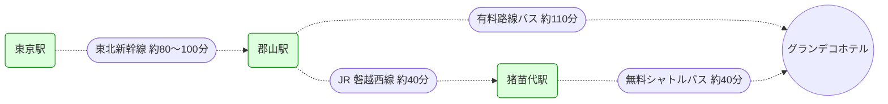

import { Steps, Aside, CardGrid } from '@astrojs/starlight/components';
import OnsenInfo from '../../../components/OnsenInfo.astro';

初心者向けコースが多く、家族連れや初級者にも優しいゲレンデ。標高が高いため積雪量が多く、オープン期間も11月下旬から4月中旬までと長い。雪質は非常に良く、パウダー好きも満足できる環境。

- **雪質とコース**: ベースでも標高1,000mを超えており、トップは1,500mオーバー。裏磐梯エリアでも屈指の雪質を誇る。
- **ロングクルージング**: 最長4,500mもの滑走が可能。初心者でも上から下まで滑ってこれるコース設計。
- **平日が狙い目**: ホテル滞在で平日にゆったり滑るのが非常におすすめ。
- **充実のリフト**: ゴンドラ1基に加え、フード・足置き付きのクワッドリフトが3基あり、移動も快適。

## 25-26シーズン営業予定

| 期間 | 予定日 |
|---|---|
| **プレシーズン** | 2025/11/22(土) 〜 2025/12/12(金) |
| **オンシーズン** | 2025/12/13(土) 〜 2026/3/29(日) |
| **スプリングシーズン** | 2026/3/30(月) 〜 2026/4/19(日) |

<Aside>
2025-26シーズンは、12月6日(土)より冬季営業を開始しています。
</Aside>

## ゲレンデ設備

- **ゴンドラ・リフト**:
  - 第1リフト（フード・足おきあり）
  - 第2リフト（フード・足おきあり・土日のみ運行）
  - 第3リフト（フード・足おきあり）
  - 6人乗りゴンドラ

- **レストラン**:
  - **マウンテンセンター (ベース)**: ハンバーガーや山塩ラーメンが人気。
  - **ゴンドラ終点**: 焼きたてのピザが楽しめる。

- **スクール**: 
  - JSBA、SAJ、SIAと主要な3種が揃っており、スノーボードのレッスンも充実。

## [EN RESORT Grandeco Hotel](https://resort.en-hotel.com/grandeco/hotel/ja/)

ゲレンデに隣接した、非常に清潔感のあるホテル。部屋も広く、ワーケーションにも適した環境が整っている。

### ⭐️ 宿泊者特典
- **ゴンドラ優先乗車**: 土日などの混雑時、ホテル宿泊者はゴンドラに優先的に乗車可能。
- **リフト券割引**: 
  - 公式サイトからの予約者：1日券 3,000円
  - ツアー予約者：3,800円
  - ※公式サイト経由の予約が最もお得。

### チェックイン・チェックアウト
- **チェックイン**: 15:00
- **チェックアウト**: 11:00

### ワーケーション環境
- **WiFi**: 非常に快適（216号室での計測例：DL 11.7Mbps / UP 25.9Mbps）。
- **作業スペース**: ラウンジに仕事ができるスペースあり。
- **サービス**: 宿泊者はセルフのコーヒーが無料。ラウンジでの焼きマシュマロサービスもある。

### 温泉

<CardGrid>
  <OnsenInfo
    name="ぶなの湯"
    hours="6:00 - 24:00"
    quality="単純泉"
    facilities={['indoor', 'outdoor', 'sauna', 'cold', 'washing']}
    amenities={['dryer']}
  />
</CardGrid>

- **アメニティ**: 部屋の浴衣で温泉への移動が可能。温泉・レストランへはスリッパでの移動もOK。
- **おもてなし**: 宿泊者向けの無料アイスキャンディサービスあり

## アクセス

東京からは東北新幹線で郡山駅へ。そこから予約制のバスで移動。

<Aside type="caution">
いずれのバスも**前日17:00までの事前予約**が必要。
</Aside>

## 荷物の送り先

- 郵便番号: 969-2701
- 住所: 福島県耶麻郡北塩原村桧原荒砂沢山
- 宛先: EN RESORT Grandeco Hotel
- 電話番号: 0241-32-3200

<Aside type="tip">
送状の備考欄に「チェックイン日」と「宿泊者名」を必ず記載すること。
</Aside>
