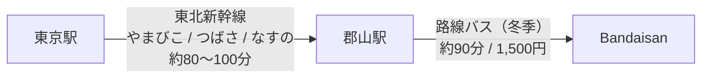

import HotelInfo from '../../../components/HotelInfo.astro';

# 概要

旧アルツ磐梯と旧猫魔スキー場が連結し、2023-2024シーズンより「星野リゾート ネコマ マウンテン」として生まれ変わりました。
南北に広がる広大なエリアで、初心者から上級者まで楽しめる33のコースを有します。

### 25-26シーズン営業期間

北エリアと南エリアで営業期間が異なりますのでご注意ください。

| エリア | 予定日 | 実際のオープン日 | 営業終了予定 |
|---|---|---|---|
| **北エリア** | 2025/11/29(土) | 2025/12/6(土) | 2026/5/6(水・祝) |
| **南エリア** | 2025/12/13(土) | 2025/12/19(金) | 2026/4/5(日) |

### オープン時のリフト・コース

**北エリア (12/6オープン)**
- リフト: デビルキャットチェア
- コース: デビル1、デビル2、デビル3

**南エリア (12/19オープン)**
- リフト: 霧氷チェア、バトウチェアを除く5本 + 連結リフト（ニャルツチェア）
- 北エリアと合わせて11リフト、19コースで営業

## 特徴

- **圧倒的なスケール**: 南北2つのエリアを行き来することで、1日では滑りきれないほどのバリエーションを楽しめます。
- **雪質**: 北エリア（旧猫魔）は標高が高く、北斜面のため「ミクロファインスノー」と呼ばれる極上のパウダースノーが楽しめます。
- **パーク**: 初心者からプロレベルまで対応した充実のスノーパークがあります。

## アクセス詳細

東京からは東北新幹線で郡山駅へ。そこから直通バスで約90分です。
または、磐梯町駅から無料シャトルバス（要予約）も利用可能です。

### 路線バス時刻表 (郡山駅 ⇔ ホテル)

**運行期間**: 2025年12月13日～2026年4月5日 (毎日運行)
**料金**: 大人片道 1,500円

| 便 | 郡山駅発 | ホテル着 |
|---|---|---|
| 1便 | 08:45 | 10:00 |
| 2便 | 10:55 | 12:10 |
| 3便 | 15:25 | 16:40 |
| 4便 | 17:45 | 19:00 |

| 便 | ホテル発 | 郡山駅着 |
|---|---|---|
| 1便 | 10:45 | 12:00 |
| 2便 | 13:30 | 14:45 |
| 3便 | 15:25 | 16:40 |
| 4便 | 17:20 | 18:35 |

<HotelInfo resortId="nekoma-mountain" />
