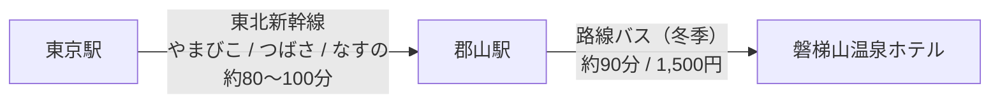

import { Steps, Aside } from '@astrojs/starlight/components';

2023-2024シーズンより旧アルツ磐梯と旧猫魔スキー場が連結した福島の広いスキー場。
非圧雪や斜度のある上級者向けのコースが多い。パークにも力を入れている。

- **南北に分かれるスキー場**: ホテルがあり、広さもある南エリア、雪質の良い北エリアに分かれる
- **雪質と圧雪**: 平日は雪不足のためか圧雪がされていないコースが多い
- **リフト**: フード付きのリフトは南エリアのアルツエキスプレス1機のみ、高速リフト1機。北エリアは高速リフト1機のみ。
- ⭐️ **パーク**: 初心者からプロレベルまで対応したスノーパークがあり、特に北エリアはオープン時から力を入れて整備している。

## 25-26シーズン営業期間

北エリアと南エリアで営業期間が異なる。

| エリア | 予定日 | 実際のオープン日 | 営業終了予定 |
|---|---|---|---|
| **北エリア** | 2025/11/29(土) | 2025/12/6(土) | 2026/5/6(水・祝) |
| **南エリア** | 2025/12/13(土) | 2025/12/19(金) | 2026/4/5(日) |

2025-26シーズンオープン時

### オープン時のリフト・コース

**北エリア (12/6オープン)**
- リフト: デビルキャットチェア
- コース: デビル1、デビル2、デビル3

**南エリア (12/19オープン)**
- リフト: 霧氷チェア、バトウチェアを除く5本 + 連結リフト（ニャルツチェア）
- 北エリアと合わせて11リフト、19コースで営業

### 南エリア オープン遅延時のホテルの対応

- 臨時のシャトルバスを運行し、ホテル宿泊者を北エリアへ送迎
- シャトルバスの所要時間： 約60分
- 時刻表： ホテル発 7:30 / 9:00 / 10:30、北エリア発 13:30 / 15:00 / 16:30
- 要予約

※ 12/16〜12/18に利用して確認

## [星野リゾート 磐梯山温泉ホテル](https://hoshinoresorts.com/ja/hotels/bandai/)

ネコマ マウンテン南エリアのゲレンデサイドに建つ、星野リゾート運営のホテル。
「会津SAKE Bar」など、地元の文化を楽しめるアクティビティがある。

### 宿泊者リフト割引

- 1日券 大人 6,300円 → 5,300円

<Aside>
ただし、オープン前の早割の方が安いので、事前に手配できるなら早割で。
</Aside>

### ⭐️ チェックイン・チェックアウト

- **チェックイン**: 16:00
- **チェックアウト**: 14:00

<Aside>
チェックアウトが14:00と遅いため、最終日も午前中しっかり滑ってから部屋で着替え・荷物整理できる。
</Aside>

### ワーケーション環境

- **WiFi**: 全館で快適に利用可能。ただし、混雑する時間帯あり。
- **作業スペース**: ラウンジでコーヒー・ココアのフリードリンクがある
- モダンツイン：客室にデスクあり（1名分）

### 食事

#### ⭐️ kisse・kisse
- 朝食：メインをアメリカンブレックファーストかわっぱ飯から選ぶ。わっぱ飯に乗せるものやパンにぬるジャムなどはビュッフェ形式
- 夕食：会津の郷土料理が楽しめるビュッフェ。メインは2日ローテーションのようなので3泊だと被る

#### 会津SAKE Bar
- **営業時間**: 15:00〜22:30（L.O.22:00）
- 会津の珍しい日本酒などがグラス200円〜300円で楽しめる

### 温泉

#### 朱嶺の湯
- **営業時間**: 6:30〜14:00（最終入場13:30）、15:00〜24:00（最終入場23:30）
- 内湯1：源泉掛け流し
- サウナあり
- 水風呂なし
- 露天なし

## アクセス

東京からは東北新幹線で郡山駅へ。そこから直通バスで約90分。

```mermaid
flowchart LR
    Tokyo[東京駅] -->|東北新幹線<br/>やまびこ / つばさ / なすの<br/>約80〜100分| Koriyama[郡山駅]

    Koriyama -->|路線バス（冬季）<br/>約90分 / 1,500円| Bandaisan[磐梯山温泉ホテル]
```

過去の利用例

#### 往路

<Steps>

1. 06:40～08:20 🚄 やまびこ203号 

2. 08:45〜10:00 🚌 路線バス

</Steps>

#### 復路

<Steps>

1. 15:25～16:40 🚌 路線バス

2. 17:16～18:36 🚄 やまびこ148号 

</Steps>

路線バス時刻表 (郡山駅 ⇔ ホテル)

**運行期間**: 2025年12月13日～2026年4月5日 (毎日運行)
**料金**: 大人片道 1,500円

| 便 | 郡山駅発 | ホテル着 |
|---|---|---|
| 1便 | 08:45 | 10:00 |
| 2便 | 10:55 | 12:10 |
| 3便 | 15:25 | 16:40 |
| 4便 | 17:45 | 19:00 |

| 便 | ホテル発 | 郡山駅着 |
|---|---|---|
| 1便 | 10:45 | 12:00 |
| 2便 | 13:30 | 14:45 |
| 3便 | 15:25 | 16:40 |
| 4便 | 17:20 | 18:35 |

https://hoshinoresorts.com/ja/hotels/bandai/access/

## 荷物の送り先

ヤマト運輸 クロネコメンバーズでの指定方法

- 電話番号: 0242745102
- 郵便番号: 9693302
- 都道府県: 福島県
- 市区郡町村: 耶麻郡磐梯町大字更科
- 丁目・番地: 字清水平６８３８－６８
- 建物・部屋番号: 磐梯山温泉ホテル
- 会社名: 磐梯山温泉ホテル

<Aside type="tip">
チェックイン日、宿泊代表者名の明記が必要。
プレー日、荷物の内容欄を利用して記載する
</Aside>
