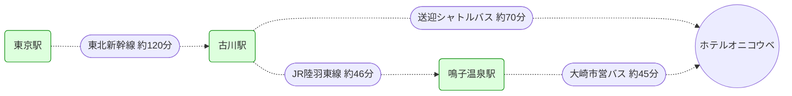

import { Steps, Aside, CardGrid } from '@astrojs/starlight/components';
import OnsenInfo from '../../../components/OnsenInfo.astro';

コースのバリエーションが素晴らしく、広さもある下部のゲレンデと自然の地形を生かした上部のコースがおすすめのゲレンデ。

- **下部ゲレンデ**: 広さがあり、初心者から中級者まで楽しめる開放的なコース
- **上部コース**: 自然の地形を活かしたバリエーション豊かなコースで上級者も満足
- **宮城県のスキー場**: 東北新幹線でアクセスしやすい宮城県のゲレンデ

## ゲレンデ情報

公式サイト: https://www.onikoube.com/snow/

## [リゾートパーク ホテルオニコウベ](https://www.oni3800.com/)

オニコウベスキー場に隣接するリゾートホテル。2つの温泉浴場があり、スキー後のリラックスに最適。

### 温泉

<CardGrid>
  <OnsenInfo
    name="3F 大浴場"
    hours="5:00〜24:00"
    quality="アルカリ性単純泉"
    facilities={['indoor', 'cold', 'washing']}
    amenities={['dryer']}
  />
  <OnsenInfo
    name="荒雄の湯"
    hours="14:00〜24:00"
    quality="アルカリ性単純泉"
    facilities={['indoor', 'outdoor', 'cold', 'sauna', 'washing']}
    amenities={['locker', 'dryer']}
  />
</CardGrid>

- **3F 大浴場**: 朝5:00から深夜24:00まで利用可能。早朝から滑る前にも、夜遅くまでゆっくり入浴できる
- **荒雄の湯**: 露天風呂とサウナを完備した充実の温泉施設

## アクセス

東京からは東北新幹線で古川駅へ。そこから送迎シャトルバスまたはJR陸羽東線で移動。

シャトルバス時刻表 (古川駅 ⇔ ホテル)

**スノーシーズン運行期間**: 2025年12月13日～2026年3月22日

**ホテル行き（迎え）**

| 便 | 古川駅発 | 鳴子温泉駅発 | ホテル着 |
|---|---|---|---|
| 1便 | 11:10 | 12:00 | 12:20 |
| 2便 | 17:10 | 18:00 | 18:20 |

**ホテル発（送り）**

| 便 | ホテル発 | 鳴子温泉駅着 | 古川駅着 |
|---|---|---|---|
| 1便 | 9:30 | 9:50 | 10:40 |
| 2便 | 11:00 | 11:20 | 12:10 |

