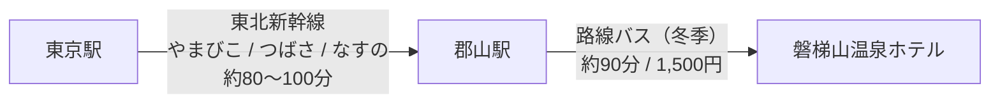

# 星野リゾート 磐梯山温泉ホテル

ネコマ マウンテン南エリアのゲレンデサイドに建つ、星野リゾート運営のホテルです。
「会津SAKE Bar」など、地元の文化を楽しめるアクティビティが充実しています。

## チェックイン・チェックアウト

- **チェックイン**: 16:00
- **チェックアウト**: 14:00

チェックアウトが14:00と遅いため、最終日も午前中しっかり滑ってから部屋で着替え・荷物整理ができます。

## ワーケーション環境

- **WiFi**: 全館で快適に利用可能です。Web会議も問題ありません。
- **作業スペース**: ラウンジ「Books & Cafe」は24時間利用可能で、コーヒー・紅茶のフリードリンクがあります。広々としたテーブルがあり、仕事に集中できます。
- モダンツイン：客室にデスクあり（1名分）

## 食事

### kisse・kisse
- 朝食：メインをアメリカンブレックファーストかわっぱ飯から選ぶ。わっぱ飯に乗せるものやパンにぬるジャムなどはビュッフェ形式
- 夕食：会津の郷土料理が楽しめるビュッフェ。メインは2日ローテーションなので3泊だと被る

### 会津SAKE Bar
- **営業時間**: 15:00〜22:30（L.O.22:00）
- 会津の珍しい日本酒などがグラス200円〜300円で楽しめる

## 温泉

### 朱嶺の湯
- **営業時間**: 6:30〜14:00（最終入場13:30）、15:00〜24:00（最終入場23:30）
- 内湯1：源泉掛け流し
- サウナあり
- 水風呂なし
- 露天なし

## アクセス詳細

東京からは東北新幹線で郡山駅へ。そこから直通バスで約90分です。

### 路線バス時刻表 (郡山駅 ⇔ ホテル)

**運行期間**: 2025年12月13日～2026年4月5日 (毎日運行)
**料金**: 大人片道 1,500円

| 便 | 郡山駅発 | ホテル着 |
|---|---|---|
| 1便 | 08:45 | 10:00 |
| 2便 | 10:55 | 12:10 |
| 3便 | 15:25 | 16:40 |
| 4便 | 17:45 | 19:00 |

| 便 | ホテル発 | 郡山駅着 |
|---|---|---|
| 1便 | 10:45 | 12:00 |
| 2便 | 13:30 | 14:45 |
| 3便 | 15:25 | 16:40 |
| 4便 | 17:20 | 18:35 |

## 宿泊者リフト割引

- 1日券 大人 6,300円 → 5,300円